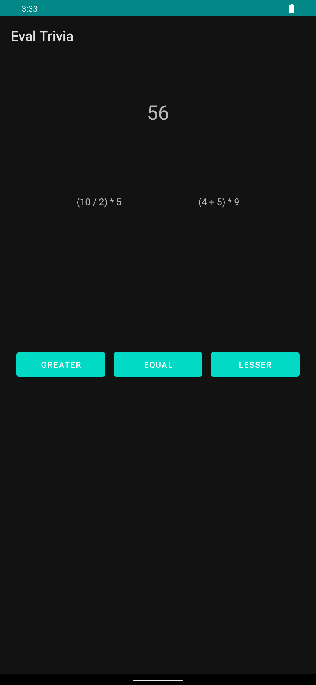

<div align = "center">

<h1><a href="https://2kabhishek.github.io/EvalTrivia">EvalTrivia</a></h1>

<a href="https://github.com/2KAbhishek/EvalTrivia/blob/main/LICENSE">
 </a>

<a href="https://github.com/2KAbhishek/EvalTrivia/pulse">
 </a>

<a href="https://github.com/2KAbhishek/EvalTrivia/stargazers">
</a>

<a href="https://github.com/2KAbhishek/EvalTrivia/network/members">
 </a>

<a href="https://github.com/2KAbhishek/EvalTrivia/watchers">
 </a>

<a href="https://github.com/2KAbhishek/EvalTrivia/graphs/contributors">
 </a>

<a href="https://github.com/2KAbhishek?tab=followers">
 </a>

<h3>Expression Evaluation Trivia 🟰🔢</h3>

<figure>
  
  <br/>
  <figcaption>EvalTrivia screenshot</figcaption>
</figure>

</div>

## What is this

EvalTrivia is a quiz game that tests your knowledge of expression evaluation.
You have to guess what the relationship between the two expressions on the left and right is.
You have a limited time to answer as many questions as you can.

## Inspiration

Was working on an expression generator, decided to make a quiz game.

## Prerequisites

Before you begin, ensure you have met the following requirements:

- You have installed the latest version of `Android Studio`

## Getting EvalTrivia

To install EvalTrivia, follow these steps:

```bash
git clone https://github.com/2kabhishek/EvalTrivia
cd EvalTrivia
```

## How it was built

EvalTrivia was built using `Android Studio`

## Challenges faced

Creating the expression generator was challenging.

## What I learned

- Explored Kotlin further.
- Android constraint layout designs.

Hit the ⭐ button if you found this useful.

## More Info

<div align="center">

<a href="https://github.com/2KAbhishek/EvalTrivia">Source</a> | <a href="https://2kabhishek.github.io/EvalTrivia">Website</a>

</div>
